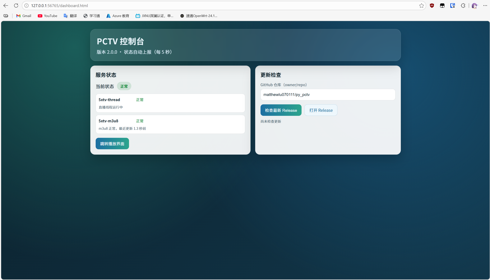
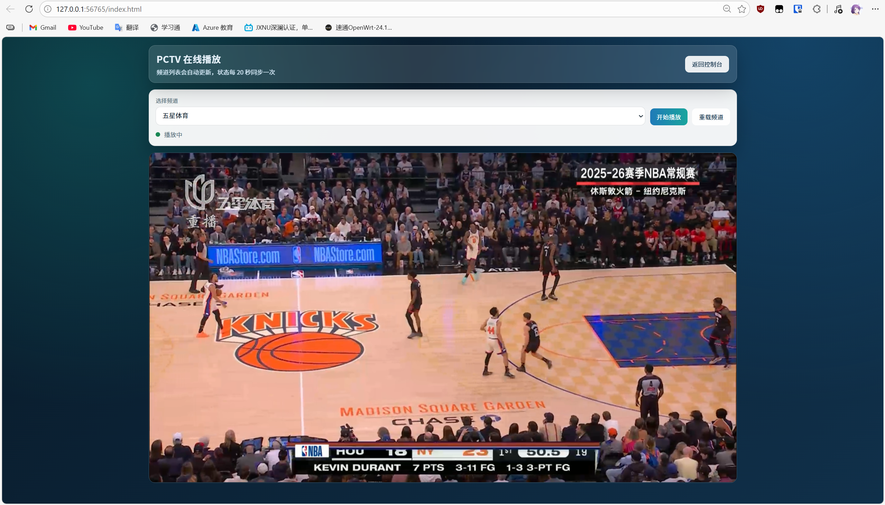

<!--
 * @Author: SudemQaQ, imxiaoanag
 * @Date: 2026-03-05
 * @Blog: https://www.imxiaoanag.com
 * @github: https://github.com/matthewlu070111/py_pctv
 * @LastEditors: imxiaoanag
 * @Description:
-->

# py_pctv

一个基于 Python 的 PC 端直播项目，当前内置五星体育源。  
项目提供控制台页面与播放页面，支持 Windows 托盘常驻运行。

## 使用

### Release 下载

普通使用不需要配置 Python 环境，直接下载并运行 `py_pctv.exe` 即可：

https://github.com/matthewlu070111/py_pctv/releases

### Windows 托盘操作

在 Windows 下运行 `py_pctv.exe` 后，程序会常驻在系统托盘（右下角通知区域）。

1. 如果托盘未直接显示，请先点右下角 `^` 展开隐藏图标。
2. 右键托盘图标可看到菜单：
- `打开控制台`：打开 `dashboard` 管理页面。
- `打开播放页`：打开播放器页面。
- `退出`：关闭常驻进程。

### 界面预览

控制台：



播放页：



## 开发

### 环境依赖

1. Python >= 3.8
2. `pip` 可用（用于安装依赖）

### 本地运行（源码）

1. 安装依赖
```bash
pip install -r requirement.ini
```
2. 启动
```bash
python py_pctv.py
```
3. 访问地址
- 控制台: `http://127.0.0.1:56765/dashboard.html`
- 播放页: `http://127.0.0.1:56765/index.html`